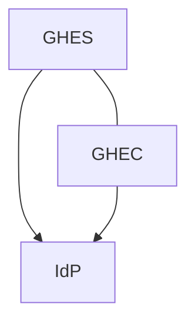

# Octomirror

Mirror an Enterprise on GitHub Enterprise Cloud (GHEC or GHEC with Data Residency) with a GitHub Enterprise Server (GHES) instance. Both deployments should be configured with the same IdP, and with the same provisioning configuration, so that all users and groups present on GHEC are also present in GHES. 

On Entra Id, that means you need to make sure both Enteprise Applications have access to the same groups. See [doc](https://docs.github.com/en/enterprise-server@3.15/admin/managing-iam/provisioning-user-accounts-with-scim/configuring-authentication-and-provisioning-with-entra-id)



Octomirror has two operating modes: `init` and `sync`. The `init` mode replicates everything on GHES, while the `sync` mode reads the audit log to find apply the changes since the specified date. This means you can run it several times a day to get incremental updates. 

Objects currently supported are: 
Object | Event | Notes
-------|-------|-------
Organizations | create, rename, delete |
Repositories | create, rename, destroy | Submodules are not supported
Custom repository roles | create, update, destroy |
Teams | create, destroy, change_parent_team, change_privacy, demote_maintainer, promote_maintainer | With and without team synchronization. Includes nested teams. Renaming a team is not yet supported. 
Team membership | add_member, remove_member | 
Repository permissions | add_repository, remove_repository, update_repository_permission |

## Enterprise App

Create an enterprise app on the Cloud instance with the following permissions. Do not forget to also install the app on the Cloud instance's Enterprise.

### Repository permissions
- Contents: Read only
- Metadata: Read only

### Organization permissions
- Administration: Read only
- Members: Read & write
- Custom organization roles: Read only

### Enterprise permissions
- Enterprise organization installation repositories: Read & write
- Enterprise organization installations: Read & write

## Environment Variables

These variables need to be defined in the shell where you will run Octomirror

- `ENTERPRISE_SLUG`: the slug of the Enterprise on the Cloud instance (`https://github.com/enteprises/<ENTERPRISE_SLUG>` or `https://<ENTERPRISE_SLUG>.ghe.com`)
- `APP_SLUG`: the slug of the octomirror app on the Cloud instance's Enterprise (`https://github.com/enterprises/fabrikam/settings/apps/<APP_SLUG>`)
- `APP_ID`: the app id of the octomirror app on the Cloud instance's Enterprise
- `CLIENT_ID`: the client id of the octomirror app on the Cloud instance's Enterprise
- `PRIVATE_KEY_FILE`: the path to file containing the private key of the octomirror app on the Cloud instance's Enterprise
- `DOTCOM_PAT`: a classic PAT on the Cloud instance with scopes `scim:enterprise`, `admin:org`, `audit_log`, `repo`. This will be removed once enterprise apps can access the audit log and scim config.
- `GHES_PAT`: the classic PAT that is used to create everything on the GHES instance. This should have `admin:enterprise`, `admin:org`, `repo`, `delete_repo`, `site_admin` and `workflow` scopes.
- `GHES_URL`: the URL of the GHES instance
- `GHES_OWNER`: the name of the owner of the repos created on the GHES instance
- `ENVIRONMENT`: Optional - set to `Development` to restrict the mirorring to the `TEST_ORG` organization
- `TEST_ORG`: Optional - only this org will be mirrored if `ENVIRONMENT` is set to `Development`

## Usage

```bash
npm start init
```

or 

```bash
npm start sync 2024-10-01
```

